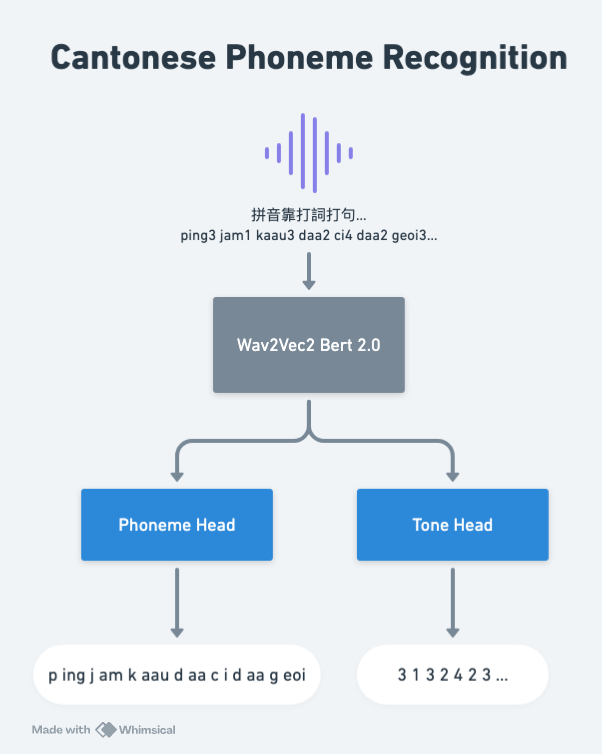

# Fine-Tune Wav2Vec2 for Jyutping Recognition



This repository contains the code for fine-tuning the [Wav2Vec Bert 2.0](https://huggingface.co/facebook/w2v-bert-2.0) model on the Common Voice 17 Cantonese dataset for Jyutping recognition. The model is trained on the [Common Voice 17 Cantonese dataset](https://huggingface.co/datasets/mozilla-foundation/common_voice_17_0).

## Requirements

To install the required packages, run the following command:

```bash
pip install -r requirements.txt
```

## Training

To train the model, run the following command:

```bash
python train.py
```

## Inference

Please clone the [repo](https://github.com/hon9kon9ize/wav2vec2bert-jyutping) and follow the instructions to run the inference.

```python
from model import Wav2Vec2BertForCantonese
from transformers import Wav2Vec2BertProcessor, SeamlessM4TFeatureExtractor, Wav2Vec2CTCTokenizer
import librosa

model_id = "hon9kon9ize/wav2vec2bert-jyutping"

tokenizer = Wav2Vec2CTCTokenizer(
    "vocab.json", unk_token="[UNK]", pad_token="[PAD]", word_delimiter_token="|"
)
tone_tokenizer = Wav2Vec2CTCTokenizer(
    "tone_vocab.json",
    unk_token="[UNK]",
    pad_token="[PAD]",
    word_delimiter_token="|",
)

# load processor
feature_extractor = SeamlessM4TFeatureExtractor.from_pretrained(model_id)
processor = Wav2Vec2BertProcessor(
    feature_extractor=feature_extractor, tokenizer=tokenizer
)

model = Wav2Vec2BertForCantonese.from_pretrained(
    model_id,
    attention_dropout=0.2,
    hidden_dropout=0.2,
    feat_proj_dropout=0.0,
    mask_time_prob=0.0,
    layerdrop=0.0,
    add_adapter=True,
    ctc_loss_reduction="mean",
    pad_token_id=processor.tokenizer.pad_token_id,
    vocab_size=len(processor.tokenizer),
).eval().cuda()

test_audio = "test.wav"

audio_input, _ = librosa.load(test_audio, sr=16_000)
input_features = processor(audio_input, return_tensors="pt", sampling_rate=16_000).input_features[0]

output = model.inference(input_features=input_features.unsqueeze(0).cuda(), processor=processor, tone_tokenizer=tone_tokenizer)

print(output) # maa4 maa1 go3 jiu4 jiu2 jiu4 jiu4 juk6 zeoi3
```