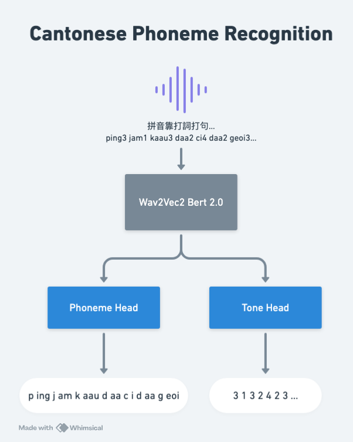

# Fine-Tune Wav2Vec2 for Jyutping Recognition



This repository contains the code for fine-tuning the [Wav2Vec Bert 2.0](https://huggingface.co/facebook/w2v-bert-2.0) model on the Common Voice 17 Cantonese dataset for Jyutping recognition. The model is trained on the [Common Voice 17 Cantonese dataset](https://huggingface.co/datasets/mozilla-foundation/common_voice_17_0).

The weights can be found on [Huggingface](https://huggingface.co/hon9kon9ize/wav2vec2bert-jyutping)

## Requirements

To install the required packages, run the following command:

```bash
pip install -r requirements.txt
```

## Training

The project supports two tone annotation formats:

- Separate tone stream: the published two-head setup using `jyutping_labels` and `tone_labels`.
- Nucleus+tone stream: a single CTC target where onsets stay tone-less and rimes carry tone, e.g. `maa4 maa1 go3` becomes `m aa4 m aa1 g o3`.

To train the published two-head format, run:

```bash
python train_w2v2bert.py facebook/w2v-bert-2.0 /path/to/dataset --output_dir checkpoints
```

To build the fallback nucleus+tone vocab from the existing tone-less vocab, run:

```bash
python build_nucleus_tone_vocab.py --output vocab_nucleus_tone.json
```

For a dataset-specific nucleus+tone vocab, use the default Hugging Face dataset:

```bash
python build_nucleus_tone_vocab.py --output vocab_nucleus_tone.json
```

This defaults to `indiejoseph/tts20250516`, using the `phone` column as inline toned Jyutping. The other TTS columns are ignored. You can also pass a local Hugging Face dataset path:

```bash
python build_nucleus_tone_vocab.py --dataset /path/to/dataset --output vocab_nucleus_tone.json
```

To train the single-head nucleus+tone format, run:

```bash
python train_w2v2bert_nucleus_tone.py facebook/w2v-bert-2.0 --output_dir checkpoints_nucleus_tone
```

This also defaults to `indiejoseph/tts20250516`, `--jyutping_column phone`, and `--annotation_type inline`. `train_w2v2bert_nucleus_tone.py` accepts `--annotation_type auto|inline|separate`. Use `inline` when the Jyutping column already contains tones such as `maa4 maa1`; use `separate` for an older Jyutping plus tone-column layout; `auto` chooses inline when it sees tone digits.

To evaluate the published two-head checkpoint on the same deterministic split, run:

```bash
python eval_original_w2v2bert.py --split test --batch_size 1
```

The split is shuffled with seed 42, then assigned as 500 test samples, 500 validation samples, and the rest for training.

Optional F0 conditioning can be enabled for tone experiments:

```bash
python train_w2v2bert_nucleus_tone.py facebook/w2v-bert-2.0 --use_f0 --output_dir checkpoints_nucleus_tone_f0
```

F0 is extracted with `librosa.pyin`, normalized per sample, interpolated to the Wav2Vec2-BERT encoder time axis, projected, and added before the CTC head.

Smoke examples for the nucleus+tone tokenizer:

```text
maa4 maa1 go3 jiu4 juk6 zeoi3 -> m aa4 m aa1 g o3 j iu4 j uk6 z eoi3
gwong2 dung1 waa2 -> gw ong2 d ung1 w aa2
m4 goi1 -> m4 g oi1
ng5 -> ng5
```

## Inference

Please clone the [repo](https://github.com/hon9kon9ize/wav2vec2bert-jyutping) and follow the instructions to run the inference.

```python
from model import Wav2Vec2BertForCantonese
from transformers import Wav2Vec2BertProcessor, SeamlessM4TFeatureExtractor, Wav2Vec2CTCTokenizer
import librosa

model_id = "hon9kon9ize/wav2vec2bert-jyutping"

tokenizer = Wav2Vec2CTCTokenizer(
    "vocab.json", unk_token="[UNK]", pad_token="[PAD]", word_delimiter_token="|"
)
tone_tokenizer = Wav2Vec2CTCTokenizer(
    "tone_vocab.json",
    unk_token="[UNK]",
    pad_token="[PAD]",
    word_delimiter_token="|",
)

# load processor
feature_extractor = SeamlessM4TFeatureExtractor.from_pretrained(model_id)
processor = Wav2Vec2BertProcessor(
    feature_extractor=feature_extractor, tokenizer=tokenizer
)

model = Wav2Vec2BertForCantonese.from_pretrained(
    model_id,
    attention_dropout=0.2,
    hidden_dropout=0.2,
    feat_proj_dropout=0.0,
    mask_time_prob=0.0,
    layerdrop=0.0,
    add_adapter=True,
    ctc_loss_reduction="mean",
    pad_token_id=processor.tokenizer.pad_token_id,
    vocab_size=len(processor.tokenizer),
).eval().cuda()

test_audio = "test.wav"

audio_input, _ = librosa.load(test_audio, sr=16_000)
input_features = processor(audio_input, return_tensors="pt", sampling_rate=16_000).input_features[0]

output = model.inference(input_features=input_features.unsqueeze(0).cuda(), processor=processor, tone_tokenizer=tone_tokenizer)

print(output) # maa4 maa1 go3 jiu4 jiu2 jiu4 jiu4 juk6 zeoi3
```
